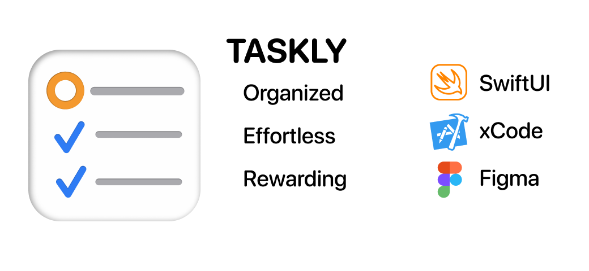

# Taskly - Organize your tasks easly

Write, execute, update and complete your tasks, projects and goals without efforts.

A clean and organized interface will help you keep track of your tasks, duties & goals, set priorities and everything will be summarized in the home page.

Organizing your goals has never been easier.
## Table of contents
* [Features](#features)
* [Tech Stack](#tech-stack)

## Features

- Create projects and organize tasks and subtasks;

- Keep an eye on the top activities and open projects from the Home page of the app;

- Add reminder for the tasks you want to deal with on a daily basis; 

- See which projects you have finished and which you have deleted;

- Earn awards to keep you morale up and running; 
## Tech Stack

**Swift/SwiftUI**

Core and fundation of the whole app developed and shipped entirly using SwiftUI. 
The whole app is taylored to perfection for every iPhone and 
in order to achive the best user experience possible, and that navite look and feel, I have implemented the following frameworks:

- **CloudKit**:
    Used for storing user settings and share it across multiple devices.    

- **Combine**:
    Used to handle asynchronous data and check if the purchase of the full app is still valid.

- **CoreData**:
    Used to keep track of the data the users add and shared it across multiple devices with CloudKit.

- **CoreSpotlight**
    Used to make the search of your projects and tasks from Spotlight and Safari.

- **UserNotifications**
    Used to push user-facing notifications when they set reminders of their tasks.

- **XCTests**
    Used to test performance, check if all the conditions are satisfied during code execution and validate user interaction flow.

- **Figma**:
    Main tool to sketch and design the logo.

- **GitHub**:
    Used to keep track of the updates of the app, new implementations and future app release versions.

